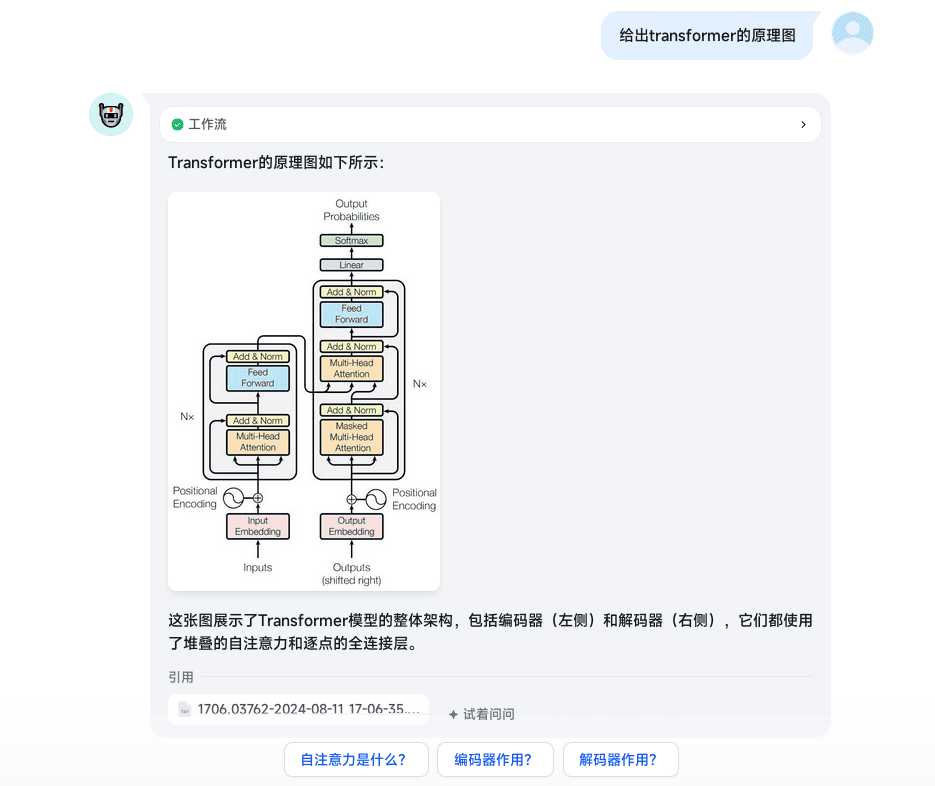
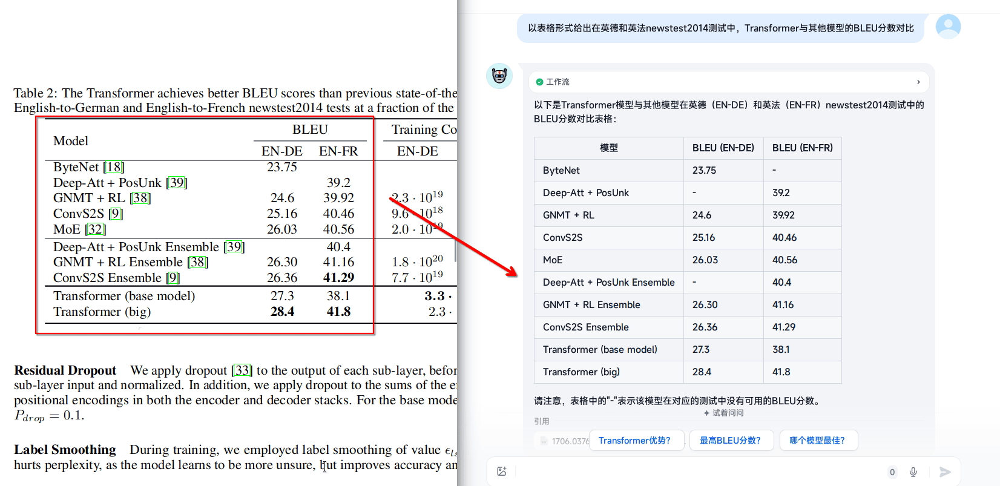
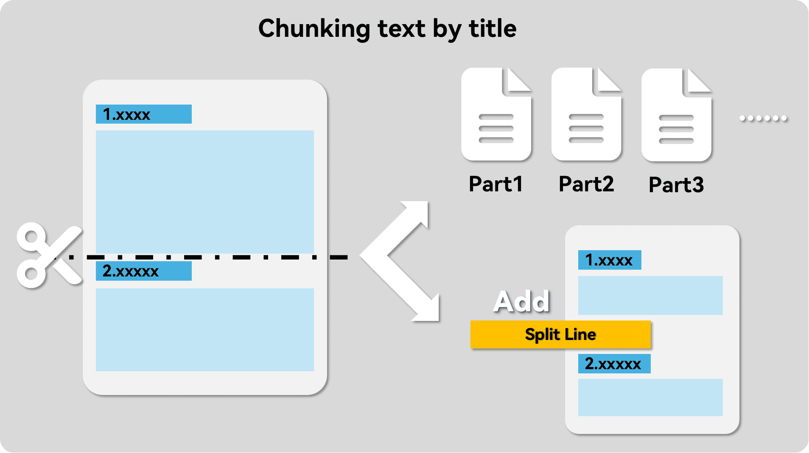
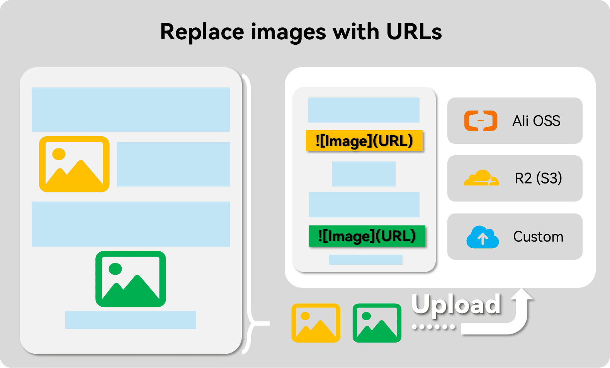
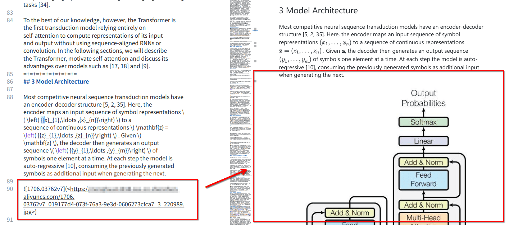
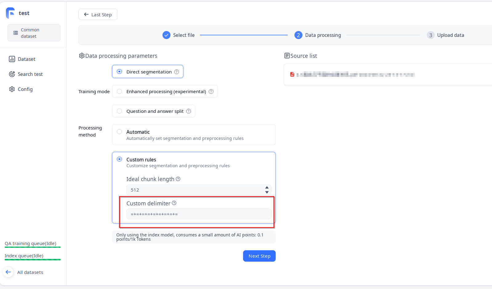
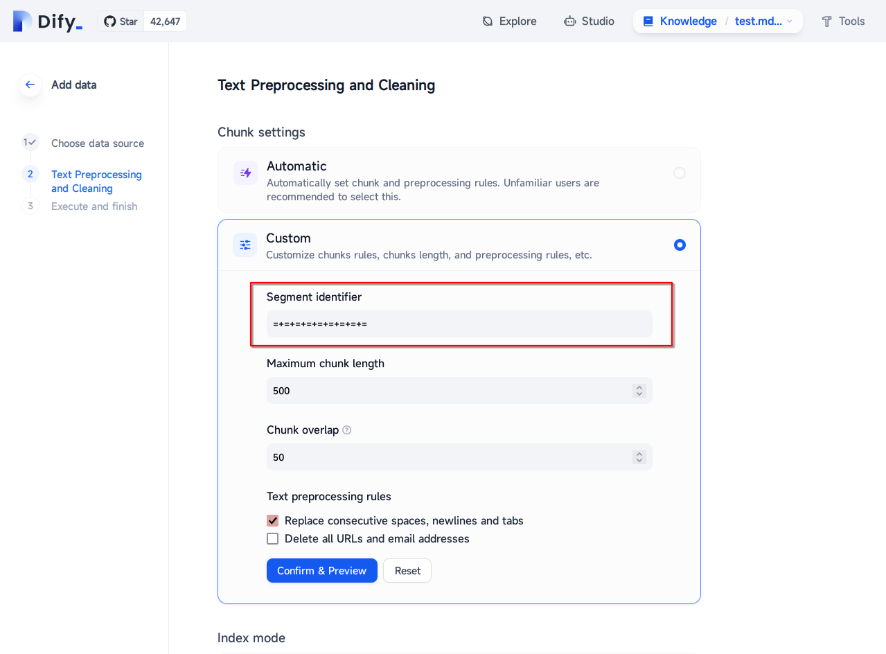

Perform some preprocessing before importing files into RAG applications (e.g. Fastgpt, Dify, etc.) to improve their recall precision while making it possible to recall both images and formula tables at the same time.

<!-- more -->

## Principle and effect demonstration

### Principle

- Convert the document, this step converts the source document **formulas** and the overall **structure**, also **tables** and **pure images** can be preserved in Doc2X.
- Split Paragraphs, this step splits the text into paragraphs. Compared to the commonly used sliding window split, it significantly enhances the relevance of the text within the chunks.
- Convert images, this step will not need to carry out OCR images, uploaded to the cloud storage (such as Ali OSS, S3, Yunyao R2), and in the form of Markdown URL image to replace the original position.

### Effect demonstration

#### Formula recall


#### Image Recall



#### Form Recall



## Install and configure the corresponding libraries

To avoid unnecessary trouble, please use a virtual environment:
- [miniconda3](https://docs.anaconda.com/miniconda/), the minimal installation version of conda, of course, you can also directly use Anaconda.
- [uv](https://github.com/astral-sh/uv), a very fast package installer and resolver built with Rust.

::: code-tabs#python

@tab conda

```bash
conda create -n rag python=3.12
conda activate rag
pip install --upgrade pdfdeal
```

@tab uv

```bash
uv venv
source .venv/bin/activate # For Linux
source .venv/Scripts/activate # For Windows
uv pip install --upgrade pdfdeal
```

:::

## Step1: Convert Documents: PDF to Markdown

> [!warning]
> From here, by default, the PDF files you need to work with are placed in the `. /Files` folder.

```python
from pdfdeal import Doc2X
from pdfdeal.file_tools import get_files, unzips

Client = Doc2X()
out_type = "md"
file_list, rename_list = get_files(path="./Files", mode="pdf", out=out_type)
success, failed, flag = Client.pdf2file(
    pdf_file=file_list,
    output_path="./Output",
    output_names=rename_list,
    output_format=out_type,
)
print(success, failed, flag)

zips = []
for file in success:
    if file.endswith(".zip"):
        zips.append(file)

success, failed, flag = unzips(zip_paths=zips)
print(success, failed, flag)
```

You should get a similar output:

```bash
['./Output/2408.07888v1.zip', './Output/1706.03762v7.zip'] [{'error': '', 'path': ''}, {'error': '', 'path': ''}] False
['./Output/2408.07888v1', './Output/1706.03762v7'] ['', ''] False
``` 

## Step2: Splitting Paragraphs

Most RAG apps offer the ability to customize paragraphs, so we can manually add separators to make them follow the paragraphs of the article, replacing the default sliding window segmentation feature. Here we are using the Replace Source Mode directly.



Please [see](https://menghuan1918.github.io/pdfdeal-docs/zh/guide/Tools/Auto_split.html).

```python
# Go up to the code in step1
from pdfdeal.file_tools import auto_split_mds

succese, failed, flag = auto_split_mds(mdpath="./Output", out_type="replace")
print(succese, failed, flag)
```

You should get a similar output:

```bash
MD SPLIT: 2/2 files are successfully splited.
Note the split string is :
=+=+=+=+=+=+=+=+=
['./1/1706.03762v7.md', './1/2408.07888v1.md'] [{'error': '', 'file': ''}, {'error': '', 'file': ''}] False
```

At this point, you can view the MD document, you can see that it has been added directly to the individual segments of the separator:


## Step3: Convert an image to an online URL

Until now, images have been rendered in the form of local paths in a style shaped like `! [123.jpg](images/123.jpg)`. Obviously, most RAG apps can't display these images, but we can upload them to a cloud storage service so they can be recalled.



Currently `pdfdeal` has built-in upload methods for AliOSS, Cloudflare R2 (actually S3 protocol), and of course you can use customized upload equations. More please see [here](../guide/Tools/Upload.md).

If you choose to use Ali OSS here, please configure the access key by yourself first. At the same time, you need to make sure that the OSS public network can be accessed, and the key has OSS read/write privileges.

> [!warning]
> If you use Ali OSS, first you need to install the package `oss2` for use: `pip install -U oss2`.
>
> If you are using the S3 protocol for uploading, first you need to install the package `boto3` to use it: `pip install -U boto3`.

> [!warning]
> The secret key is already configured in the environment variable.

```python
# Go up to the code in Step2
from pdfdeal.FileTools.Img.Ali_OSS import Ali_OSS
from pdfdeal.file_tools import mds_replace_imgs
import os

ossupload = Ali_OSS(
    OSS_ACCESS_KEY_ID=os.environ.get("OSS_ACCESS_KEY_ID"),
    OSS_ACCESS_KEY_SECRET=os.environ.get("OSS_ACCESS_KEY_SECRET"),
    Endpoint=os.environ.get("Endpoint"),
    Bucket=os.environ.get("Bucket"),
)

succese, failed, flag = mds_replace_imgs(
    path="Output",
    replace=ossupload,
    threads=5,
)
print(succese, failed, flag)
```

Subsequently checking the MD documentation again, the image has now been replaced with a URL and its displaying straight away on recall in most RAG apps:



## The complete program

```python
from pdfdeal import Doc2X
from pdfdeal.file_tools import get_files, unzips, auto_split_mds, mds_replace_imgs
from pdfdeal.FileTools.Img.Ali_OSS import Ali_OSS
import os

Client = Doc2X()
out_type = "md"
file_list, rename_list = get_files(path="./Files", mode="pdf", out=out_type)
success, failed, flag = Client.pdf2file(
    pdf_file=file_list,
    output_path="./Output",
    output_names=rename_list,
    output_format=out_type,
)
print(success, failed, flag)

zips = []
for file in success:
    if file.endswith(".zip"):
        zips.append(file)
success, failed, flag = unzips(zip_paths=zips)
print(success, failed, flag)

succese, failed, flag = auto_split_mds(mdpath="./Output", out_type="replace")
print(succese, failed, flag)

ossupload = Ali_OSS(
    OSS_ACCESS_KEY_ID=os.environ.get("OSS_ACCESS_KEY_ID"),
    OSS_ACCESS_KEY_SECRET=os.environ.get("OSS_ACCESS_KEY_SECRET"),
    Endpoint=os.environ.get("Endpoint"),
    Bucket=os.environ.get("Bucket"),
)

succese, failed, flag = mds_replace_imgs(
    path="Output",
    replace=ossupload,
    threads=5,
)
print(succese, failed, flag)
```

## Access to RAG applications

### Fastgpt

Follow the normal knowledge base import process by importing the final Markdown document obtained above, followed by selecting the custom processing rules and filling in the separators in the second step **Data Processing**:



### Dify

> [!warning]
> As of version 0.7.1 at the time of writing, Dify's handling of Markdown files is still buggy, and no matter what settings are used, it **automatically deletes** all URLs as well as HTML tags in the file.
>
> **Be sure to change the md format to txt and upload it!**
>
> Please see this [issue](https://github.com/langgenius/dify/issues/7228)

**First change the md format of all files to txt format.**


Subsequently, follow the normal knowledge base import process, followed by importing the final **txt** document obtained above, followed by selecting the custom processing rules and filling in the segment identifiers in the second step **Data Processing**:



## Also see

- [FastGPT Docs](https://doc.fastgpt.in/docs/)
- [Dify Docs](https://docs.dify.ai/)
- [Issue: Delete all URLs and email addresses option does not work when uploading Markdown documents](https://github.com/langgenius/dify/issues/7228)
- [RAG预处理增强：让Fastgpt/Dify召回更多东西](https://blog.menghuan1918.com/posts/RAG_predeal.html)