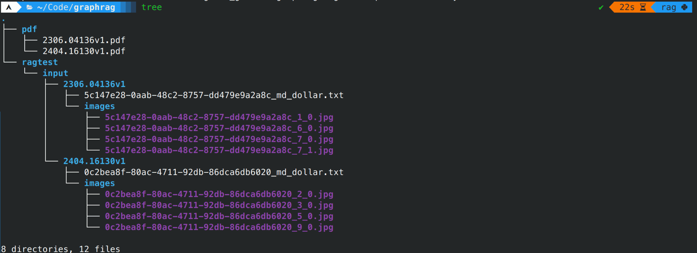

## Install and configure the corresponding libraries

To avoid unnecessary trouble, please use a virtual environment:
- [miniconda3](https://docs.anaconda.com/miniconda/), the minimal installation version of conda, of course, you can also directly use Anaconda.
- [uv](https://github.com/astral-sh/uv), a very fast package installer and resolver built with Rust.

::: code-tabs#python

@tab conda

```bash
conda create -n rag python=3.12
conda activate rag
pip install --upgrade pdfdeal graphrag
```

@tab uv

```bash
uv venv
source .venv/bin/activate # For Linux
source .venv/Scripts/activate # For Windows
uv pip install --upgrade graphrag pdfdeal
```

:::

## Step1: Convert PDF

Create two folders to store the PDFs before processing and the txt files after processing:

```bash
mkdir ./pdf
mkdir -p ./ragtest/input
```

Put the PDFs to be processed into the pdf folder, here using graphrag's [own paper](https://arxiv.org/pdf/2404.16130) and it's [references](https://arxiv.org/pdf/2306.04136).

Go to [Doc2X](https://doc2x.com/), click on identity information, and copy your identity token as a key.

Use `pdfdeal`'s CLI tool `doc2x` for batch processing, please add the long flag `--graphrag` to enable special adaptation for graphrag:

```bash
doc2x -k "Your Key Here" -o ./ragtest/input -p --graphrag ./pdf
```


Wait for it to complete processing:



## Step2: Build knowledge graph

```bash
python -m graphrag.index --init --root ./ragtest
```

Modify `settings.yaml` and `.env` files, then build:

```bash
python -m graphrag.index --root ./ragtest
```


After building is complete, you can start asking questions to graphrag using different answering strategies:

::: code-tabs

@tab global

```bash
python -m graphrag.query \
--root ./ragtest \
--method global \
"Q"
```

@tab local

```bash
python -m graphrag.query \
--root ./ragtest \
--method local \
"Q"
```

:::

## See Also

- [graphrag official website](https://microsoft.github.io/graphrag/)
- [将PDF知识图谱化：graphrag+Doc2X+DeepSeek](https://blog.menghuan1918.com/posts/graphrag_doc2x_deepseek.html)