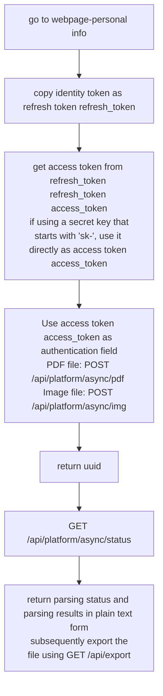

Use the following statement to import all asynchronous request functions:

```python
from pdfdeal.Doc2X.Convert import *
```

## Request flow



## `refresh_key`

Get access token access_token by personal key.

### Parameters

| Parameter | Type | Description |
|------|------|------|
| `key` | `str` | Personal Key |

### Exceptions

|Exception | Description |
|------|------|
| `Exception` | Failed to validate key |

### Return Value

| Type | Description |
|------|------|
| `str` | Access Token |

### Notes

- This function uses the `@async_retry()` decorator, which automatically backs out and retries twice on failure.

## `upload_pdf`

Asynchronously uploads a PDF file to the server and returns the UUID of the file.

### Parameters

| Parameter | Type | Default | Description |
|------|------|----------|--------|
| `apikey` | `str` | Required | API key |
| `pdffile` | `str` | Required | PDF file path |
| `ocr` | `bool` | `True` | Whether to do OCR processing |
| `translate` | `bool` | `False` | Whether or not to translate |
| `language` | `str` | `“zh”` | The language of the file, valid only if `translate` is `True` |
| `model` | `str` | `“deepseek”` | Translation model, valid only when `translate` is `True` |

### Exceptions

|Exception | Description |
|------|--------|
| `FileError` | Input file size too large |
| `FileError` | Open File Error |
| `RateLimit` | Request Rate Limit Exceeded |
| `Exception` | Upload file error |

### Return Value

| Type | Description |
|------|--------|
| `str` | The UUID of the file |

### Notes

- This function uses the `@async_retry()` decorator, which automatically backs out and retries twice on failure.
- The `language` and `model` arguments are valid when `translate` is `True`.

> [!caution]
> Please note that the above `translate` translation interface was implemented by a packet grabber to obtain the delivery method, it is not officially supported and its availability is not guaranteed.

## `upload_img`

Asynchronously uploads an image file to the server and returns the UUID of the file.

### Parameters

| Parameter | Type | Default | Description |
|------|------|----------|--------|
| `apikey` | `str` | Required | API key |
| `imgfile` | `str` | Required | Image file path |
| `formula` | `bool` | `False` | Whether to be in formula-only mode |
| `img_correction` | `bool` | `False` | Whether or not to perform image correction |

### Exceptions

| Exceptions | Description |
|------|--------|
| `FileError` | Image file size too large |
| `FileError` | Open File Error |
| `RateLimit` | Request Rate Limit Exceeded |
| `Exception` | Upload file error |

### Return Value

| Type | Description |
|------|--------|
| `str` | UUID of the file |

### Notes

- This function uses the `@async_retry()` decorator, which automatically backs out and retries twice on failure.

## `uuid_status`

Asynchronous function to get the status of the document, both for PDF and image UUID.

### Parameters

| Parameter | Type | Default | Description |
|------|------|----------|--------|
| `apikey` | `str` | mandatory | API key |
| `uuid` | `str` | Required | UUID of the file |
| `convert` | `bool` | `False` | Whether or not to convert |
| `translate` | `bool` | `False` | Whether to use the translation interface |

### Return Value

Returns a tuple `(progress, status, texts)` with three elements:

1. `progress` (`int`): progress percentage
2. `status` (`str`): Description of the status.
3. `texts` (`list`): list of texts, recognized plain text results

### Exceptions

- `RuntimeError`: Page Limit Exceeded
- `RuntimeError`: unknown state
- `Exception`: Error getting state

### Notes

- This function uses the `@async_retry()` decorator, which automatically backs out and retries twice on failure.

> [!caution]
> Please note that the above `translate` translation interface was implemented by a packet grabber to obtain the delivery method, it is not officially supported and its availability is not guaranteed.

## `uuid2file`

Gets the file by UUID and saves it in the specified format.

> [!warning]
> Please poll for the file status first and call this function after the final processing is successful.

### Parameters

| Parameters | Type | Default Value | Description |
|------|------|----------|--------|
| `apikey` | `str` | Mandatory | API key |
| `uuid` | `str` | Required | UUID of the file |
| `output_format` | `Literal[“md”, “md_dollar”, “latex”, “docx”]` | Required | Output format |
| `output_path` | `str` | `". /Output"` | Output path |

| Exceptions | Description |
|------|--------|
| `Exception` | Input path is not a directory |
| `RateLimit` | Rate limit exceeded |
| `Exception` | Download File Error |

### Return Value

| Type | Description |
|------|--------|
| `str` | Path to file |

### Notes

- This function uses the `@async_retry()` decorator, which automatically backs out and retries twice on failure.

## `get_limit`

Asynchronous function to get the remaining amount of the API key.

### Parameters

| Parameter | Type | Description |
|------|------|------|
| `apikey` | `str` | API key |

### Exceptions

| Exceptions | Description |
|------|------|
| `RuntimeError` | Thrown when key is invalid |

### Return Value

| Type | Description |
|------|------|
| `int` | Remaining amount of API key |

### Notes

- This function uses the `@async_retry()` decorator, which automatically backs out and retries twice on failure.