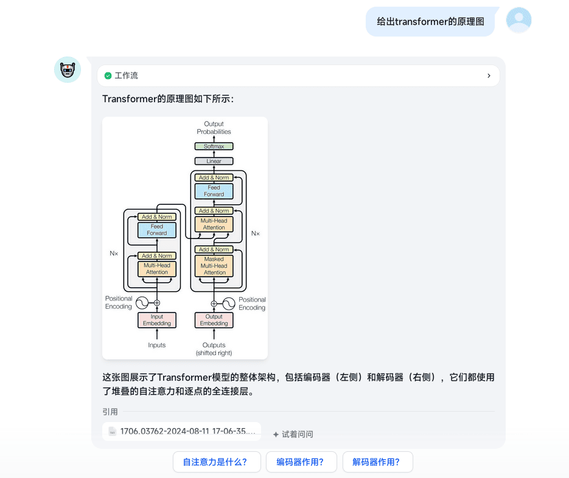
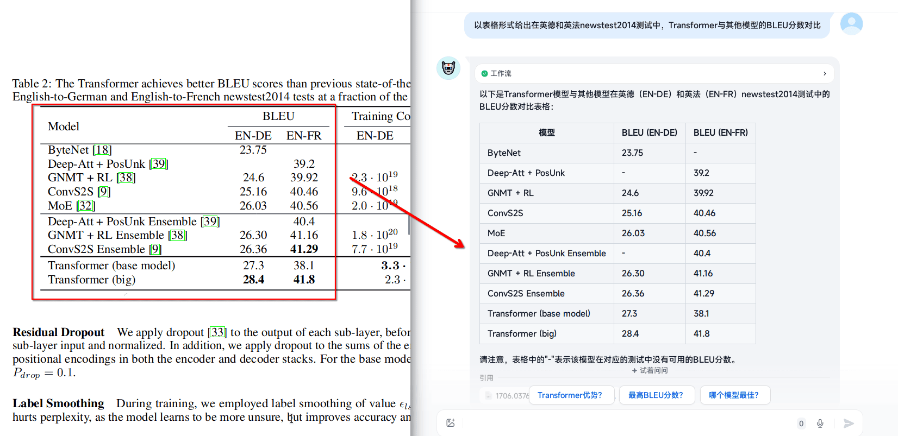
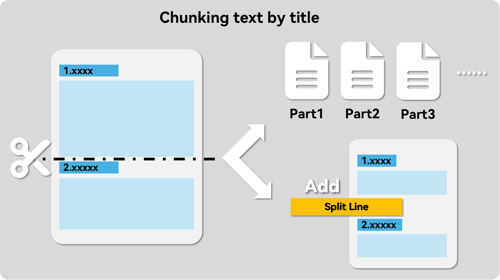
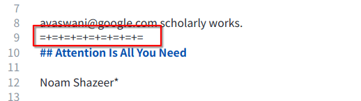
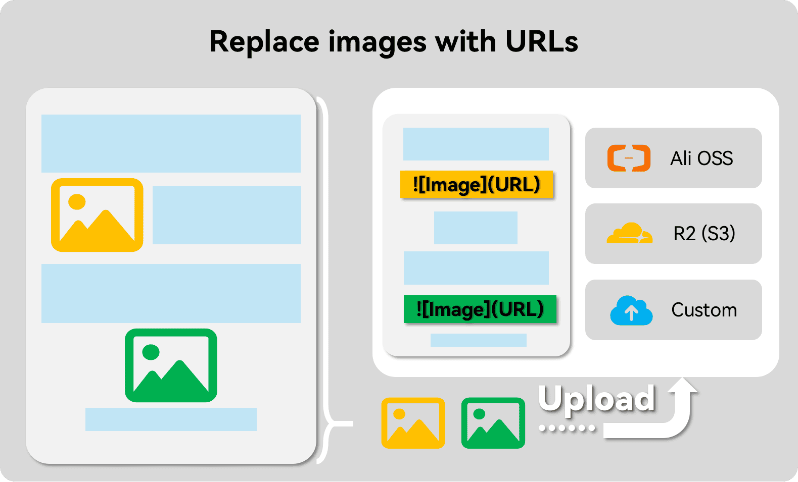
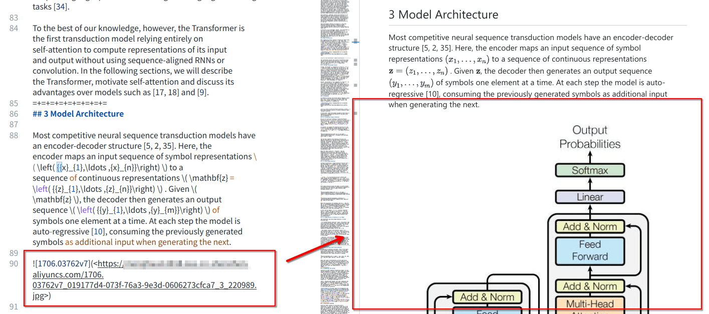

在导入文件到RAG应用(例如Fastgpt，Dify等)前进行一些预处理，提升其召回精度的同时，使其也能同时召回将图片与公式表格等内容。

<!-- more -->

## 原理以及效果演示

### 原理

- 转换文档，这一步中转换源文档中**公式**和整体**结构**，除此外Doc2X还能将**表格**以及**纯图片**保留下来。
- 拆分段落，这一步将文本按照段落拆分开。对比普遍使用的滑动窗口拆分方式，其能显著加强分块内文本的相关度。
- 转换图片，这一步将不需要进行OCR的图片，上传至云储存(例如阿里OSS，S3，CloudflareR2)，并以Markdown的形式的URL图片替换原有的位置。

### 效果演示

#### 公式召回


#### 图片召回



#### 表格召回



## 安装并配置相应的库

为避免不必要的麻烦，请使用虚拟环境：
- [miniconda3](https://docs.anaconda.com/miniconda/),conda的最小化安装版本，当然您也可以直接使用Anaconda。
- [uv](https://github.com/astral-sh/uv)，一个非常快的包安装程序和解析器，使用Rust构建。

::: code-tabs#python

@tab conda

```bash
conda create -n rag python=3.12
conda activate rag
pip install --upgrade pdfdeal
```

@tab uv

```bash
uv venv
source .venv/bin/activate # For Linux
source .venv/Scripts/activate # For Windows
uv pip install --upgrade pdfdeal
```

:::

## Step1：转换文档:PDF转Markdown

> [!warning]
> 从此处开始，默认你需要处理的PDF文件放置在`./Files`文件夹中。

```python
from pdfdeal import Doc2X
from pdfdeal.file_tools import get_files, unzips

Client = Doc2X()
out_type = "md"
file_list, rename_list = get_files(path="./Files", mode="pdf", out=out_type)
success, failed, flag = Client.pdf2file(
    pdf_file=file_list,
    output_path="./Output",
    output_names=rename_list,
    output_format=out_type,
)
print(success, failed, flag)

zips = []
for file in success:
    if file.endswith(".zip"):
        zips.append(file)

success, failed, flag = unzips(zip_paths=zips)
print(success, failed, flag)
```

你应当得到类似的输出：

```bash
['./Output/2408.07888v1.zip', './Output/1706.03762v7.zip'] [{'error': '', 'path': ''}, {'error': '', 'path': ''}] False
['./Output/2408.07888v1', './Output/1706.03762v7'] ['', ''] False
``` 

## Step2：拆分段落

大多数RAG应用都会提供自定义段落的功能，我们可以手动添加分隔符使其按照文章的段落进行分段，替换其默认的滑动窗口分段功能。此处直接使用的替换源文件模式。



详细参照[此处](https://menghuan1918.github.io/pdfdeal-docs/zh/guide/Tools/Auto_split.html)。

```python
# 上接step1中的代码
from pdfdeal.file_tools import auto_split_mds

succese, failed, flag = auto_split_mds(mdpath="./Output", out_type="replace")
print(succese, failed, flag)
```

你应当得到类似的输出：

```bash
MD SPLIT: 2/2 files are successfully splited.
Note the split string is :
=+=+=+=+=+=+=+=+=
['./1/1706.03762v7.md', './1/2408.07888v1.md'] [{'error': '', 'file': ''}, {'error': '', 'file': ''}] False
```

此时再查看MD文档，可以看到其在各个分段直接已经添加上了分隔符了：



## Step3：转换图片为在线URL

到目前为止，图片的形式都还是以本地路径呈现的，其样式形如``。显而易见地，大部分RAG应用并不能显示这些图片,不过我们可以将其上传到云端储存服务从而使其能被召回。



目前`pdfdeal`中内置有阿里OSS，CloudflareR2(其实就是S3协议)的上传方法，当然你也可以使用自定义的上传方程。更多请参见[此处](../guide/Tools/Upload.md)。

此处选择使用阿里OSS，请首先自行配置好访问密匙。同时你需要确保OSS公网可访问，且密匙有OSS的读写权限。

> [!warning]
> 如您使用阿里OSS，首先您需要安装包`oss2`进行使用：`pip install -U oss2`
>
> 如您使用S3协议上传，首先您需要安装包`boto3`进行使用：`pip install -U boto3`

> [!warning]
> 此处的密匙已经在环境变量中配置好了

```python
# 上接Step2中的代码
from pdfdeal.FileTools.Img.Ali_OSS import Ali_OSS
from pdfdeal.file_tools import mds_replace_imgs
import os

ossupload = Ali_OSS(
    OSS_ACCESS_KEY_ID=os.environ.get("OSS_ACCESS_KEY_ID"),
    OSS_ACCESS_KEY_SECRET=os.environ.get("OSS_ACCESS_KEY_SECRET"),
    Endpoint=os.environ.get("Endpoint"),
    Bucket=os.environ.get("Bucket"),
)

succese, failed, flag = mds_replace_imgs(
    path="Output",
    replace=ossupload,
    threads=5,
)
print(succese, failed, flag)
```

随后再查看MD文档，现在图片已经被替换为URL了，其在大部分的RAG应用中召回时也能直接显示了：



## 完整的程序

```python
from pdfdeal import Doc2X
from pdfdeal.file_tools import get_files, unzips, auto_split_mds, mds_replace_imgs
from pdfdeal.FileTools.Img.Ali_OSS import Ali_OSS
import os

Client = Doc2X()
out_type = "md"
file_list, rename_list = get_files(path="./Files", mode="pdf", out=out_type)
success, failed, flag = Client.pdf2file(
    pdf_file=file_list,
    output_path="./Output",
    output_names=rename_list,
    output_format=out_type,
)
print(success, failed, flag)

zips = []
for file in success:
    if file.endswith(".zip"):
        zips.append(file)
success, failed, flag = unzips(zip_paths=zips)
print(success, failed, flag)

succese, failed, flag = auto_split_mds(mdpath="./Output", out_type="replace")
print(succese, failed, flag)

ossupload = Ali_OSS(
    OSS_ACCESS_KEY_ID=os.environ.get("OSS_ACCESS_KEY_ID"),
    OSS_ACCESS_KEY_SECRET=os.environ.get("OSS_ACCESS_KEY_SECRET"),
    Endpoint=os.environ.get("Endpoint"),
    Bucket=os.environ.get("Bucket"),
)

succese, failed, flag = mds_replace_imgs(
    path="Output",
    replace=ossupload,
    threads=5,
)
print(succese, failed, flag)
```

## 接入RAG应用

### Fastgpt

按照正常的知识库导入流程，将上面得到的最后的Markdown文档导入，随后在第二步**数据处理**的时候选择自定义处理规则，填入分隔符：


### Dify

> [!warning]
> 截止编写时的版本0.7.1，Dify对Markdown文件处理依然存在Bug，无论使用什么设置，其都会**自动删除**文件中的所有网址以及HTML标签。
>
> **请务必将md格式改为txt格式后上传！**
>
> 详细请参见这个[issue](https://github.com/langgenius/dify/issues/7228)

**首先将所有文件的md格式改为txt格式。**


随后按照正常的知识库导入流程，随后将上面得到的最后的**txt**文档导入，随后在第二步**数据处理**的时候选择自定义处理规则，填入分段标识符：


## 参见

- [FastGPT Docs](https://doc.fastgpt.in/docs/)
- [Dify Docs](https://docs.dify.ai/)
- [Issue: Delete all URLs and email addresses option does not work when uploading Markdown documents](https://github.com/langgenius/dify/issues/7228)
- [RAG预处理增强：让Fastgpt/Dify召回更多东西](https://blog.menghuan1918.com/posts/RAG_predeal.html)