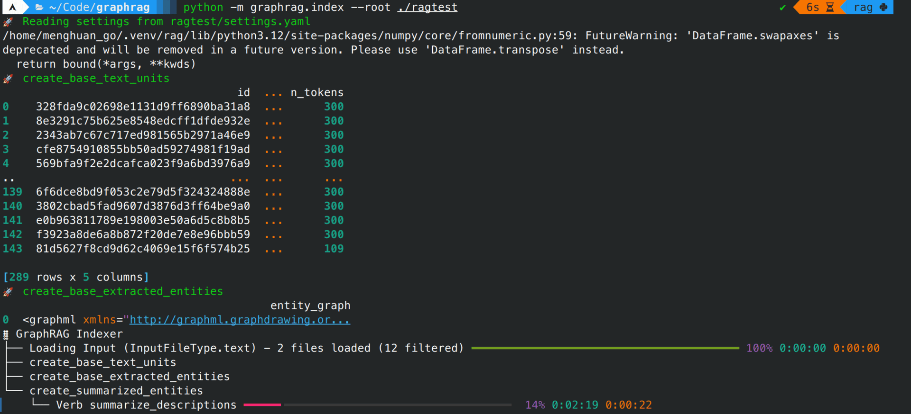

## 安装并配置相应的库

为避免不必要的麻烦，请使用虚拟环境：
- [miniconda3](https://docs.anaconda.com/miniconda/),conda的最小化安装版本，当然您也可以直接使用Anaconda。
- [uv](https://github.com/astral-sh/uv)，一个非常快的包安装程序和解析器，使用Rust构建。

::: code-tabs#python

@tab conda

```bash
conda create -n rag python=3.12
conda activate rag
pip install --upgrade pdfdeal graphrag
```

@tab uv

```bash
uv venv
source .venv/bin/activate # For Linux
source .venv/Scripts/activate # For Windows
uv pip install --upgrade graphrag pdfdeal
```

:::

## Step1:转换PDF

新建两个文件夹，用于存储处理前的PDF以及处理后的txt文件：

```bash
mkdir ./pdf
mkdir -p ./ragtest/input
```

把要处理的pdf丢到pdf文件夹中，这儿使用的graphrag[论文本身](https://arxiv.org/pdf/2404.16130)以及[参考文献](https://arxiv.org/pdf/2306.04136)。

前往[Doc2X](https://doc2x.noedgeai.com/)，点击身份信息，复制你的身份令牌作为密匙。

使用`pdfdeal`的CLI工具`doc2x`进行批处理，请加上长标示`--graphrag`以启用对graphrag的特殊适配：

```bash
doc2x -k "Your Key Here" -o ./ragtest/input --graphrag ./pdf
```


等候其处理完成：


## Step2:构建知识图谱

```bash
python -m graphrag.index --init --root ./ragtest
```

修改`settings.yaml`以及`.env`文件，随后进行构建：

```bash
python -m graphrag.index --root ./ragtest
```



构建完成后您就可以对graphrag发起提问了，使用不同的回答策略：

::: code-tabs

@tab global

```bash
python -m graphrag.query \
--root ./ragtest \
--method global \
"问题"
```

@tab local

```bash
python -m graphrag.query \
--root ./ragtest \
--method local \
"问题"
```

:::

## 参见

- [graphrag官网](https://microsoft.github.io/graphrag/)
- [将PDF知识图谱化：graphrag+Doc2X+DeepSeek](https://blog.menghuan1918.com/posts/graphrag_doc2x_deepseek.html)