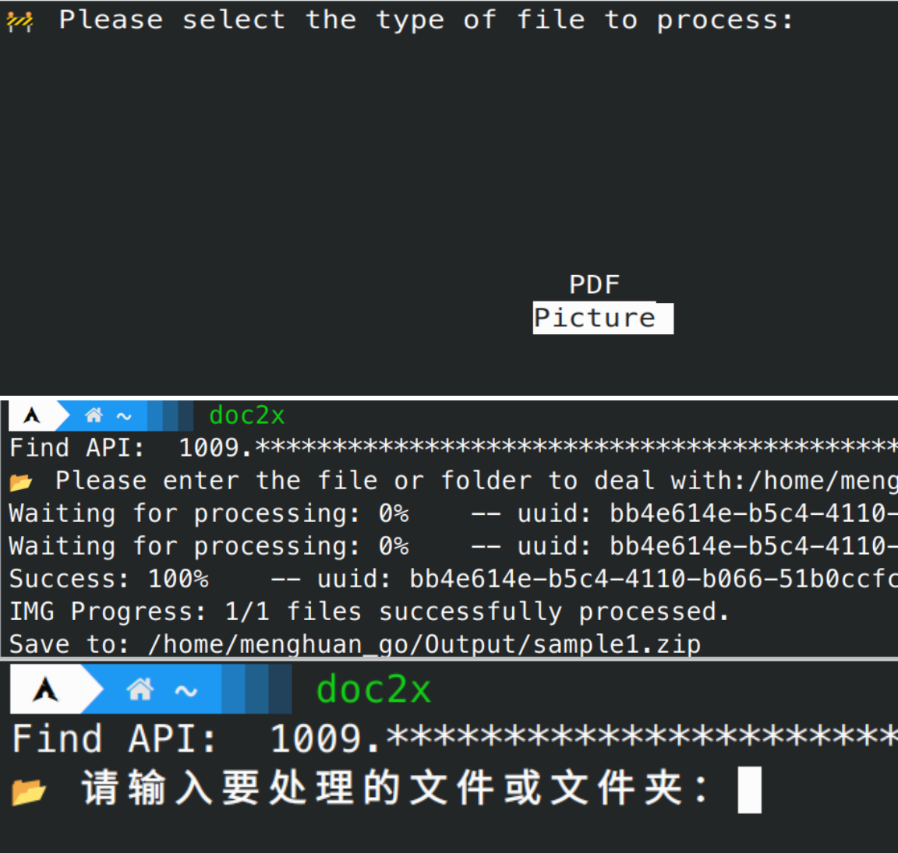

## `doc2x` 命令使用说明

`doc2x` 命令用于批量处理 PDF 或图片文件，将其转换为多种输出格式。

### 位置参数

| 参数       | 描述                           |
|------------|--------------------------------|
| `filename` | 待处理的 PDF 或图片文件/文件夹 |

### 可选参数

| 短标志 | 长标志           | 描述                                                                                         |
|--------|------------------|---------------------------------------------------------------------------------------------|
| `-h`   | `--help`         | 显示帮助信息并退出                                                                           |
| `-y`   |                  | 跳过任何需要用户二次输入的场景                                                               |
| `-k`   | `--api_key`      | Doc2X 的 API 密钥，如果未设置，将使用全局设置                                                 |
| `-r`   | `--rpm`          | Doc2X 的速率限制，如果不清楚请不要设置                                                       |
| `-o`   | `--output`       | 结果的输出文件夹，如果未设置，将默认输出到 './Output'                                         |
| `-f`   | `--format`       | 结果的输出格式，支持 `md`、`md_dollar`、`latex`、`docx`，默认是 `md_dollar`                   |
| `-i`   | `--image`        | 如果输入是图片，设置此标志为 True，否则会询问用户                                             |
| `-p`   | `--pdf`          | 如果输入是 PDF，设置此标志为 True，否则会询问用户                                             |
| `--equation` |        | 是否使用纯公式模式，仅对图片有效，默认是 False                                                 |
| `-c`   | `--clear`        | 清除所有关于 Doc2X 的全局设置                                                               |
| | `--graphrag`| 将 md 文档转换为 txt 格式，用于将输出转换为 graphRAG 可接受的 txt 格式。此时输出格式需要指定为 md 或 md_dollar |
| | `--unzip`| 自动将zip文件解压(当非docx输出格式时默认输出是一个zip压缩包)|

您可以直接输入`pythom -m doc2x`来运行程序，其会引导您输入剩余所需的参数。注意此时输出路径会是默认的'./Output'，格式为默认的`md_dollar`



## 示例

### 将./pdf文件夹中所有pdf转换为graphRAG接受的txt格式

```bash
doc2x -k "YOUR_KEY_HERE" -o ./ragtest/input -p --graphrag ./pdf 
```

### 将./pdf文件夹中所有pdf文件转换为md文件

```bash
doc2x -p -o ./Output --unzip ./pdf 
```