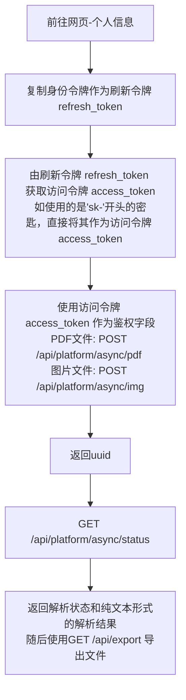

使用以下语句导入所有的异步请求函数：

```python
from pdfdeal.Doc2X.Convert import *
```

## 请求流程



## `refresh_key`

通过个人密钥获取访问令牌access_token。

### 参数

| 参数 | 类型 | 描述 |
|------|------|------|
| `key` | `str` | 个人密钥 |

### 异常

| 异常 | 描述 |
|------|------|
| `Exception` | 验证密钥失败 |

### 返回值

| 类型 | 描述 |
|------|------|
| `str` | 访问令牌 |

### 装饰器

| 装饰器 | 描述 |
|--------|------|
| `@async_retry()` | 异步重试装饰器，用于在失败时自动重试 |

### 注意事项

- 该函数使用 `@async_retry()` 装饰器，其会在失败时自动退避重试两次。

## `upload_pdf`

异步上传 PDF 文件到服务器并返回文件的 UUID。

### 参数

| 参数 | 类型 | 默认值 | 描述 |
|------|------|----------|--------|
| `apikey` | `str` | 必填 | API 密钥 |
| `pdffile` | `str` | 必填 | PDF 文件路径 |
| `ocr` | `bool` | `True` | 是否进行 OCR 处理 |
| `translate` | `bool` | `False` | 是否进行翻译 |
| `language` | `str` | `"zh"` | 文件的语言，仅在 `translate` 为 `True` 时有效 |
| `model` | `str` | `"deepseek"` | 翻译模型，仅在 `translate` 为 `True` 时有效 |

### 异常

| 异常 | 描述 |
|------|--------|
| `FileError` | 输入文件大小过大 |
| `FileError` | 打开文件错误 |
| `RateLimit` | 请求速率限制超出 |
| `Exception` | 上传文件错误 |

### 返回值

| 类型 | 描述 |
|------|--------|
| `str` | 文件的 UUID |

### 注意事项

- 该函数使用 `@async_retry()` 装饰器，其会在失败时自动退避重试两次。
- 当 `translate` 为 `True` 时，`language` 和 `model` 参数才有效。

> [!caution]
> 请注意，以上的`translate`翻译接口由抓包获得传递方式并实现，并非官方支持，不保证可用性


## `upload_img`

异步上传图像文件到服务器并返回文件的UUID。

### 参数

| 参数 | 类型 | 默认值 | 描述 |
|------|------|----------|--------|
| `apikey` | `str` | 必填 | API密钥 |
| `imgfile` | `str` | 必填 | 图像文件路径 |
| `formula` | `bool` | `False` | 是否为纯公式模式 |
| `img_correction` | `bool` | `False` | 是否进行图像校正 |

### 异常

| 异常 | 描述 |
|------|--------|
| `FileError` | 图像文件大小过大 |
| `FileError` | 打开文件错误 |
| `RateLimit` | 请求速率限制超出 |
| `Exception` | 上传文件错误 |

### 返回值

| 类型 | 描述 |
|------|--------|
| `str` | 文件的UUID |

### 注意事项

- 该函数使用 `@async_retry()` 装饰器，其会在失败时自动退避重试两次。


## `uuid_status`

获取文件状态的异步函数，同时适用于PDF和图片的UUID。

### 参数

| 参数 | 类型 | 默认值 | 描述 |
|------|------|----------|--------|
| `apikey` | `str` | 必填 | API 密钥 |
| `uuid` | `str` | 必填 | 文件的 UUID |
| `convert` | `bool` | `False` | 是否进行转换 |
| `translate` | `bool` | `False` | 是否使用的翻译接口 |

### 返回值

返回一个包含三个元素的元组 `(progress, status, texts)`：

1. `progress` (`int`): 进度百分比
2. `status` (`str`): 状态描述
3. `texts` (`list`): 文本列表，识别的纯文本结果

### 异常

- `RuntimeError`: 页面限制超出
- `RuntimeError`: 未知状态
- `Exception`: 获取状态错误

### 注意事项

- 该函数使用 `@async_retry()` 装饰器，其会在失败时自动退避重试两次。

> [!caution]
> 请注意，以上的`translate`翻译接口由抓包获得传递方式并实现，并非官方支持，不保证可用性

## `uuid2file`

通过 UUID 获取文件并将其保存为指定格式的文件。

> [!warning]
> 请先进行轮询查询文件状态，最终处理成功后再调用此函数。

### 参数

| 参数 | 类型 | 默认值 | 描述 |
|------|------|----------|--------|
| `apikey` | `str` | 必填 | API 密钥 |
| `uuid` | `str` | 必填 | 文件的 UUID |
| `output_format` | `Literal["md", "md_dollar", "latex", "docx"]` | 必填 | 输出格式 |
| `output_path` | `str` | `"./Output"` | 输出路径 |

### 异常

| 异常 | 描述 |
|------|--------|
| `Exception` | 输入路径不是一个目录 |
| `RateLimit` | 超出速率限制 |
| `Exception` | 下载文件错误 |

### 返回值

| 类型 | 描述 |
|------|--------|
| `str` | 文件的路径 |

### 注意事项

- 该函数使用 `@async_retry()` 装饰器，其会在失败时自动退避重试两次。

## `get_limit`

异步函数，用于获取API密钥的剩余额度。

### 参数

| 参数 | 类型 | 描述 |
|------|------|------|
| `apikey` | `str` | API密钥 |

### 异常

| 异常 | 描述 |
|------|------|
| `RuntimeError` | 当密钥无效时抛出 |

### 返回值

| 类型 | 描述 |
|------|------|
| `int` | API密钥的剩余额度 |

### 注意事项

- 该函数使用 `@async_retry()` 装饰器，其会在失败时自动退避重试两次。