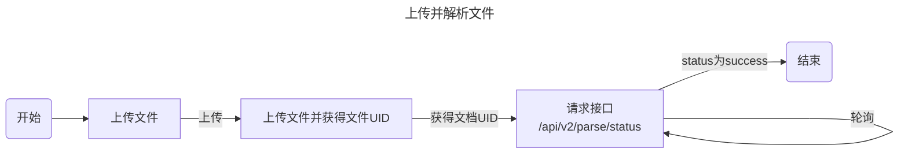
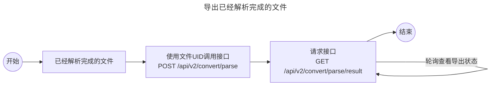

```python
from pdfdeal.Doc2X.ConvertV2 import upload_pdf, uid_status,convert_parse,get_convert_result
```

    > [!warning]
    > 如您想要快速处理PDF文件，请参见[封装的同步方法](./Init.md)

## 上传并解析文件


### 上传文件并获得文件UID

`upload_pdf` 是一个异步函数，用于将 PDF 文件上传到服务器，并返回文件的唯一标识符（UID）。

#### 参数

- `apikey` (`str`): 用于认证的 API 密钥。
- `pdffile` (`str`): 待上传的 PDF 文件路径。

#### 异常

- `FileError`: 当输入文件过大时抛出。
- `FileError`: 当打开文件出错时抛出。
- `RateLimit`: 当请求超过速率限制时抛出。
- `Exception`: 当上传文件出错时抛出。

#### 返回

- `str`: 上传文件的唯一标识符（UID）。

#### 示范代码

::: tabs#code

@tab Python
```python
from pdfdeal.Doc2X.ConvertV2 import upload_pdf
import asyncio

uid = asyncio.run(upload_pdf(apikey="sk-xxx", pdffile="tests/pdf/sample.pdf"))
print(uid)
```
@tab Jupyter Notebook
```python
from pdfdeal.Doc2X.ConvertV2 import upload_pdf

uid = await upload_pdf(apikey="sk-xxx", pdffile="tests/pdf/sample.pdf")
print(uid)
```
:::

#### 返回示例

```bash
0192a90a-0c17-7729-a436-18320b7e9bf0
```

### 获取文件状态

`uid_status` 是一个异步函数，用于获取文件的处理状态。

#### 参数

- `apikey` (`str`): 用于认证的 API 密钥。
- `uid` (`str`): 文件的唯一标识符。
- `convert` (`bool`, 可选): 是否将 "[" 和 "[[" 转换为 "$" 和 "$$"。默认为 `False`。

#### 异常

- `RequestError`: 当处理文件失败时抛出。
- `Exception`: 当获取状态出错时抛出。

#### 返回

- `Tuple[int, str, list, list]`: 返回一个元组，包含进度、状态、文本和位置。

#### 示范代码

::: tabs#code

@tab Python
```python
from pdfdeal.Doc2X.ConvertV2 import uid_status
import asyncio

process, status, texts, locations = asyncio.run(
    uid_status(
        apikey="sk-xxx",
        uid="0192a90a-0c17-7729-a436-18320b7e9bf0",
    )
)

print(process, status, texts, locations)
```
@tab Jupyter Notebook
```python
from pdfdeal.Doc2X.ConvertV2 import uid_status

process, status, texts, locations = await uid_status(
    apikey="sk-xxx",
    uid="0192a90a-0c17-7729-a436-18320b7e9bf0",
)
process, status, texts, locations
```
:::

#### 返回示范

```
(100,
 'Success',
 ['Test 测试', ''],
 [{'url': '', 'page_idx': 0, 'page_width': 2334, 'page_height': 1313},
  {'url': '', 'page_idx': 1, 'page_width': 2334, 'page_height': 1313}])
```

## 导出文件




### 导出已解析的文件

#### 描述
`convert_parse` 函数用于将已解析的文件转换为指定格式。这是一个异步函数，需要在异步环境中调用。

#### 参数

| 参数名    | 类型  | 描述                                           | 是否可选 | 默认值 |
|-----------|-------|------------------------------------------------|----------|--------|
| `apikey`  | str   | API密钥                                        | 否       | N/A    |
| `uid`     | str   | 已解析文件的唯一标识符                         | 否       | N/A    |
| `to`      | str   | 导出格式，支持：md、tex、docx、md_dollar       | 否       | N/A    |
| `filename`| str   | md/tex格式的输出文件名（不包含扩展名）         | 是       | None   |

#### 返回值
返回一个元组，包含以下内容：
1. 转换状态的字符串描述。
2. 转换后文件的URL。

#### 异常

| 异常类型      | 描述                           |
|---------------|--------------------------------|
| `ValueError`  | 如果 'to' 不是有效的格式       |
| `RequestError`| 如果转换失败                   |
| `Exception`   | 处理过程中的任何其他错误       |

#### 示范代码

::: tabs#code

@tab Python
```python
from pdfdeal.Doc2X.ConvertV2 import convert_parse
import asyncio

status, url = asyncio.run(
    convert_parse(
        apikey="sk-xxx",
        uid=uid,
        to="docx",
    )
)

print(status, url)
```
@tab Jupyter Notebook
```python
from pdfdeal.Doc2X.ConvertV2 import convert_parse

status, url = await convert_parse(
    apikey="sk-xxx",
    uid=uid,
    to="docx",
)
status, url
```
:::

#### 返回示范

```
('Processing', '')
```


### 获取转换结果

`get_convert_result` 是一个异步函数，用于获取转换任务的结果。

#### 参数

- `apikey` (`str`): 用于认证的 API 密钥。
- `uid` (`str`): 转换任务的唯一标识符。

#### 返回

返回一个元组，包含以下内容：
1. 转换状态的字符串描述。
2. 转换后文件的URL。

#### 异常

- `RequestError`: 如果请求失败。
- `Exception`: 处理过程中的任何其他错误。

#### 示范代码

::: tabs#code

@tab Python
```python
from pdfdeal.Doc2X.ConvertV2 import get_convert_result
import asyncio

status, url = asyncio.run(
    get_convert_result(
        apikey="sk-xxx",
        uid=uid,
        to="docx",
    )
)

print(status, url)
```
@tab Jupyter Notebook
```python
from pdfdeal.Doc2X.ConvertV2 import get_convert_result

status, url = await get_convert_result(
    apikey="sk-xxx",
    uid=uid,
    to="docx",
)
status, url
```
:::


#### 返回示范

```
('Success',
 'https://doc2x-backend.s3.cn-north-1.amazonaws.com.cn/objects/0192e2a9-90e8-7984-8860-979267ce6d74/convert_docx_origin.docx?X-Amz-Algorithm=AWS4-HMAC-SHA256&X-Amz-Credential=xxxxxxxxxxx')
```
